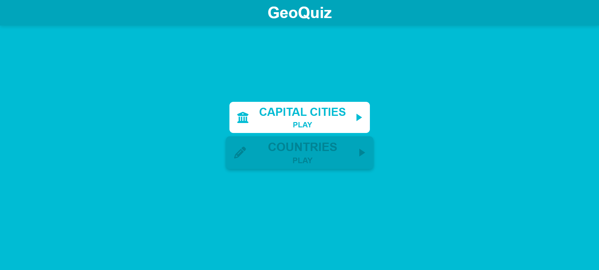
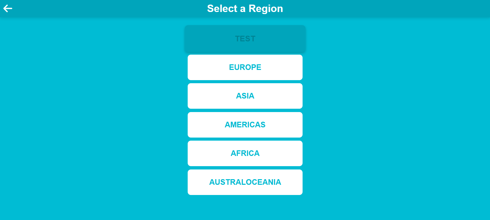
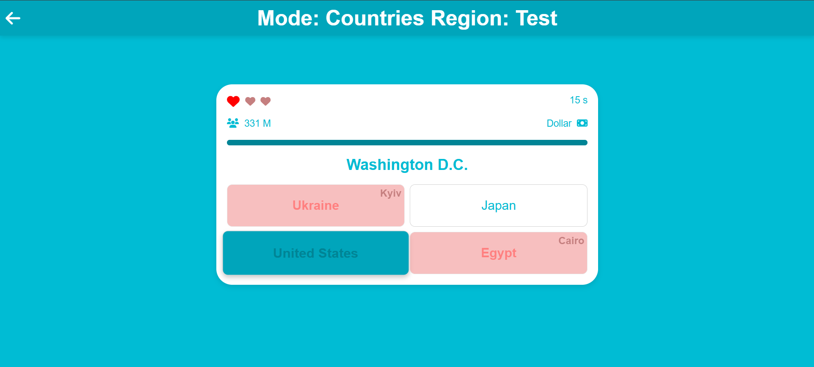
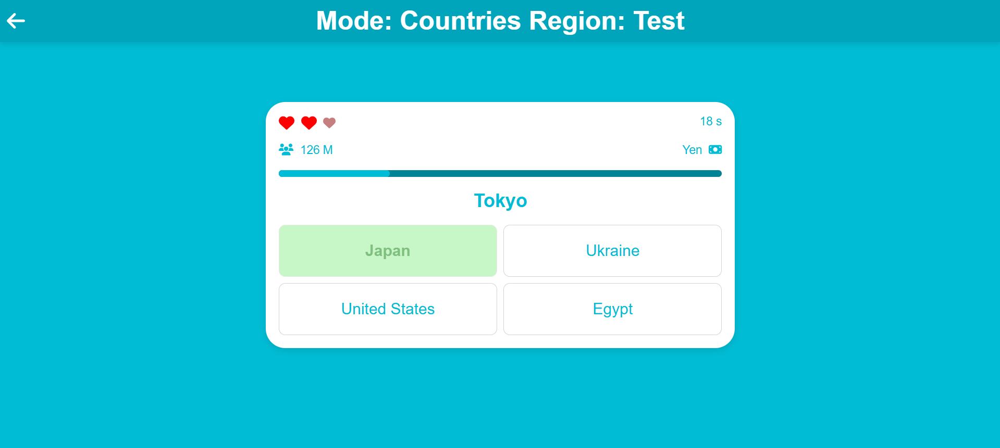
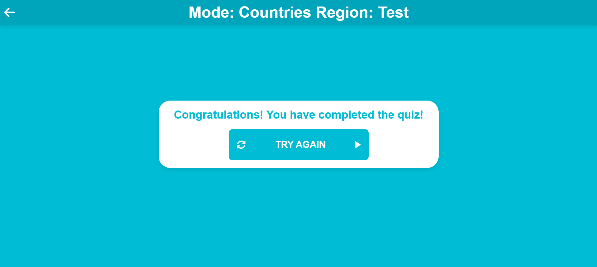
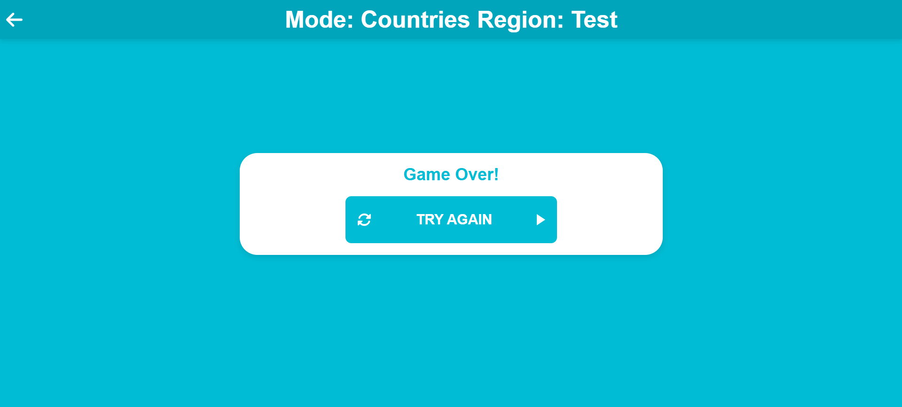

# GeoQuiz

A quiz that allows you to pump up your knowledge of geography *(especially relevant for tenth-graders)*. You will be able to learn the capitals of all countries and countries by their capitals!

---

## Features
- **Different modes:** Capital cities and countries;
- **Different regions:** Test _(set of several countries for running the game functionality)_, Europe, Asia, Americas, Africa, Australoceania;
- **Interesting quiz mechanics:** Lives system and timers _(running out of timer on a question removes one life)_, shuffling of answers within the region;
- **Absence of russia:** very necessary and convenient;

---

## Prerequisites
Ensure you have the following installed:

**Node.js 16 or higher**

Download it from the [official Node.js website](https://nodejs.org/).

---

## How to Run
1. Clone the repository:
   ```bash
   $ git clone https://github.com/LikerFeed/GeoQuiz.git
   ```
2. Navigate to the project directory:
    ```bash
   $ cd GeoQuiz
   ```
3. Install the dependencies:
    ```bash
   $ npm i
   ```
4. Run the game:
   ```bash
   $ npm run dev
   ```
5. Open the game in your browser at http://localhost:5173.
---

## How to play GeoQuiz
- **Select Mode and Region:** On the first page, select the capital cities or countries mode and the region for your game on the corresponding second region selection page;
- **Play the quiz:** explore the capitals of the entire region, track your progress and save lives. Complete completion of the region is considered to be the full filling of the progress bar with at least one life saved;
- **Timer:** you are given 20 seconds to answer the question, if you do not have time, the timer will restart, but one life will be lost;
- **Lives:** These are given to you for the entire round and are lost when you choose the wrong answer and the timer runs out;
- **Hints:** information about currency and population that helps you remember the answer better and also deepens your knowledge;
- **Progress bar:** advances as questions are answered;
- **Learning from mistakes:** If you choose the wrong answer, there will be a hint on the button indicating who the answer actually belongs to;
---

## Screenshots






